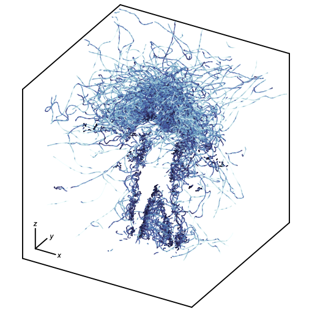
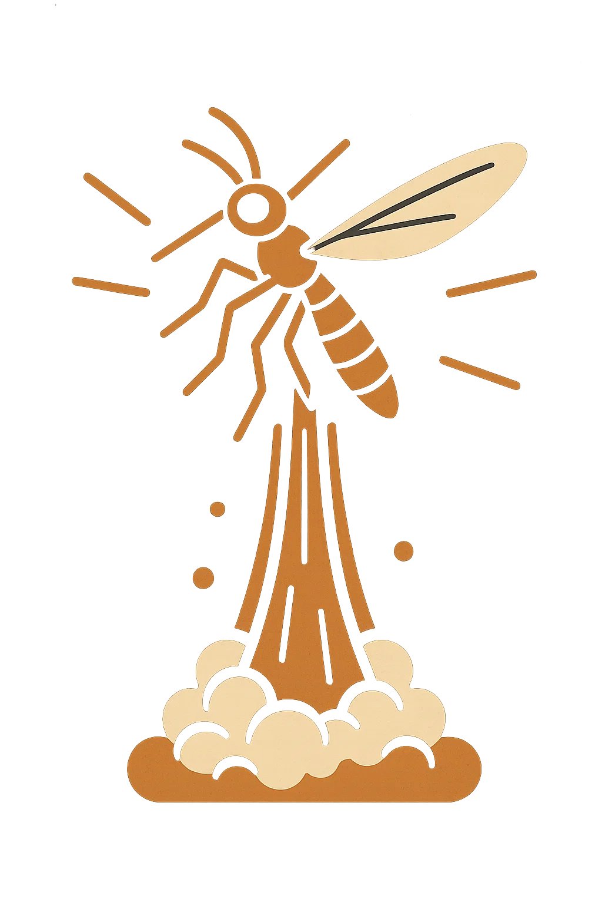

# Predicting moqsuito flight behavior using Bayesian dynamical systems learning 

<div align="center" style="display: flex; justify-content: center; align-items: center;">
	</img>
	<video height="300" autoplay loop muted playsinline>
		<source src="docs/human_experiment.mp4" type="video/mp4">
		Your browser does not support the video tag.
	</video>
</div>


This is the official repository for the paper [**_Predicting mosquito flight behavior using Bayesian dynamical systems learning_**](link_to_paper_coming_soon).
We combine 3D infrared tracking of *Aedes aegypti* with Bayesian dynamical systems inference to learn quantitative biophysical models of mosquito host-seeking behavior.

##  Quick Start

#### 1. Data download:
The data is hosted on [zenodo](https://zenodo.org/records/15277051). To download the dataset, we have provided a bash script `scripts/download_data.sh`. You can run this script with
```bash
bash scripts/download_data.sh [DESTINATION_DIR] 
```
`DESTINATION_DIR` is the directory to save the downloaded files. The default is `data`, and we recommend leaving this as some of the provided code uses this directory.
#### 2. Setup
To set up the Julia package with the necessary dependencies, run
```bash
julia scripts/setup.jl
```
> **NOTE**: You must have Julia downloaded and installed. You can install the latest version [here](https://julialang.org/downloads/). We recommend having at least version 1.11.
#### 3. Data visualization
To filter and visualize our datasets, check out the `examples/00_data_viz.ipynb` notebook. Make sure to download the data in the `data` directory before running this notebook.
#### 4. Inference on simulated system without cues
To see a walk through of how to perform inference on a simulated system of mosquitos without any sensory cues, see `examples/01_Sim_NoCues.ipynb`. In this notebook, we recreate Figure S3 in our paper.
#### 5. Inference on simulated system with repelling
To see a walk through of how to perform inference on a simulated system of mosquitos that are repelled from a center point, see `examples/02_Sim_Repellent.ipynb`. In this notebook, we recreate Figure S4 in our paper.
#### 6. Inference on real mosquito data with visual cues
To see a walk through of how to perform inference on a mosquito dataset with visual and CO<sub>2</sub> cues, see `examples/03_Real_Inference.ipynb`. In this notebook, we recreate Figure 4 B and C in our paper.
#### 7. Simulation of inferred mosquito models
To see a walk through of how to simulate the inferred mosquito models and generate synthetic trajectories, see `examples/04_Real_LearnedModels.ipynb`. In this notebook, we create plots similar to Figure 5 C, F, I, and L of our paper.

##  Interactive web application
We developed an [interactive web application](mosquitoapp-production.up.railway.app) for users to explore our models. The application allows users to specify which sensory cues are present, originating at the center of the image in the screen. Mosquitos move in real time and the user can move the image around to change the position of the cues. Users can also replace the default spongebob image for fun!

## 🙏 Acknowledgements
TODO: CDC

## 📌 Citation
Please cite our paper if you find it useful for your work.
TODO: add citation
